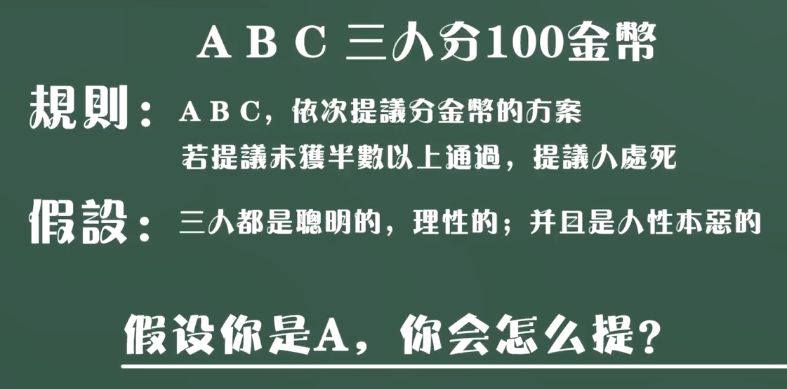

1. 只剩 B、C

> ∵ 若提议未获半数以上通过，提议处死。
>
> ∴ B 必死，C 拿到 100 枚金币。

2. A 无论说什么提议，B 都必须支持

> 确保不会出现 “只剩 B、C”。

3. A 得 100，B 得 0，C 得 0

> A 知道 B 一定会支持自己。

## M 上场

1. M 获得 98，A 得 0，B 得 1，C 得 1

> M 先选，具有先手优势。B、C 低端人群，容易被拉拢。

2. A 想获得利益

> 就只能把 M 干掉。
>
> 或者共谋 B、C 平分金币。

